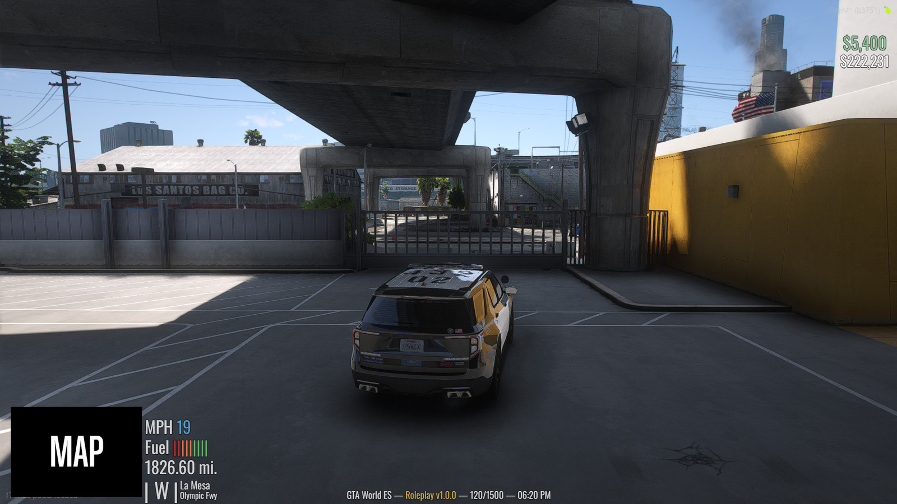
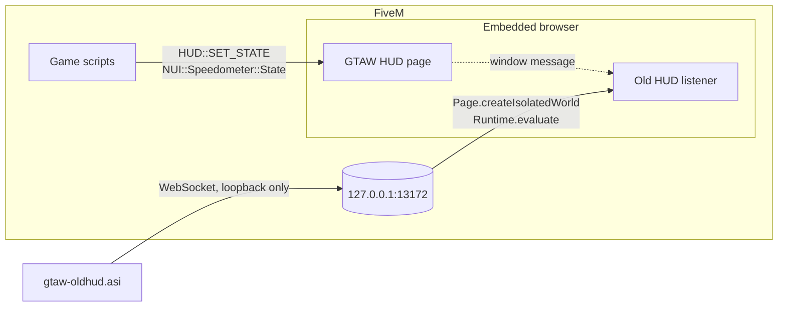
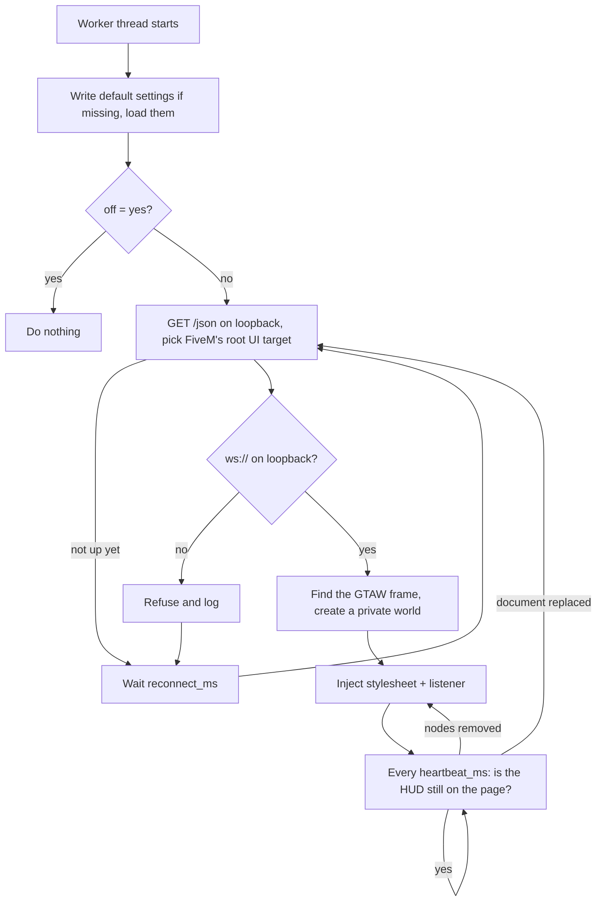
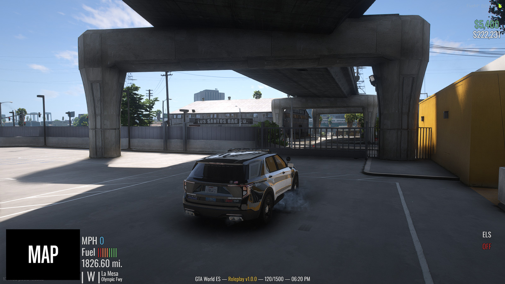
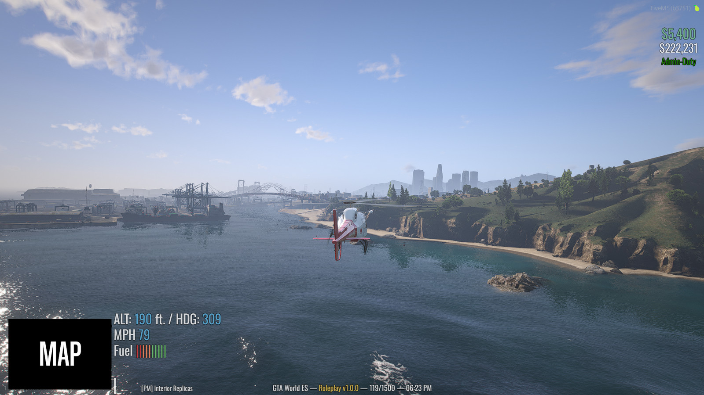
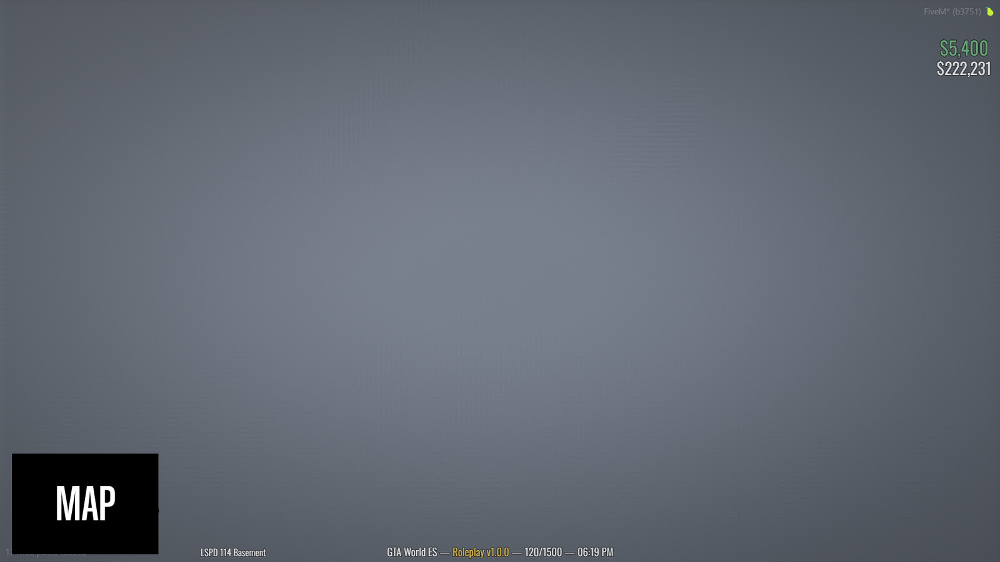
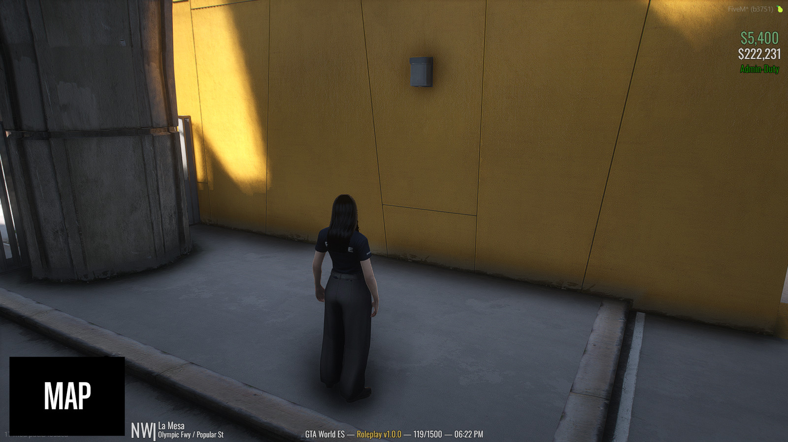

<h1 align="center">
  GTA World · OG HUD
</h1>

<p align="center">
  <a href="LICENSE"></a>
  <a href="CHANGELOG.md"></a>
  <a href="https://github.com/MatiDeZeta/gtaw-oldhud/actions/workflows/build.yml"></a>
  <a href="https://github.com/MatiDeZeta/gtaw-oldhud/releases/latest"></a>
  <a href="https://fivem.net/"></a>
  <a href="build.bat"></a>
</p>

<p align="center">
  The old GTA World HUD, back on top of the new one — <strong>one file, no companion app, no server resource</strong>.
</p>

> Green cash and white bank at the top right, the direction, area and street beside the minimap, speed, fuel and mileage stacked above them, and the single server line along the bottom. Every line where the old HUD drew it, at the size the old HUD drew it, at any resolution.

> [**ⓘ**](#security) **Security:** the plugin only *listens*. It hooks nothing, patches nothing, calls no game native, never sends a message and opens exactly one socket — to `127.0.0.1`.

<p align="center">
  <a href="docs/screenshots/vehicle.jpg"></a>
</p>

<details>
<summary><strong>Layout, as the old HUD drew it</strong></summary>

```
                                                                              $600
                                                                         $118,264


   ┌──────────────┐  MPH 0
   │              │  Fuel ||||||||
   │   minimap    │  29.65 mi.
   │              │
   └──────────────┘ | S | Pillbox Hill
                        Elgin Ave

           GTA.WORLD — Roleplay v1.8.8a — 188/1500 — 14:07
```

</details>

---

## Install

1. Download `gtaw-oldhud.asi` from the [latest release](https://github.com/MatiDeZeta/gtaw-oldhud/releases/latest), or [build it yourself](#building).
2. Drop it into your FiveM `plugins` folder:
   ```
   %LOCALAPPDATA%\FiveM\FiveM.app\plugins\
   ```
   A portable install uses its own `FiveM.app\plugins` instead — `D:\FiveM\FiveM.app\plugins`, say.
3. Launch FiveM and join GTA World. The old HUD appears as soon as the game's HUD is up.
4. Leave GTAW's own `/settings` HUD toggles switched **on**. The plugin makes the current widgets transparent rather than removing them, and that is what keeps their data flowing.

On first run the plugin writes `gtaw-oldhud.settings.txt` next to itself — every option listed, explained and set to its default — and `gtaw-oldhud.log`, recording every connection attempt, install and failure. `gtaw-oldhud.layout.txt` appears once the old HUD has been placed with [`/hudlayout`](#the-layout-editor).

> [**ⓘ**](#settings) Set `hide_new = none` to see both HUDs at once, which is handy for lining things up.

<details>
<summary><strong>More information</strong></summary>

### Why?

GTA World replaced its HUD. Some of us preferred the old one — the plain white text beside the minimap, the green cash figure, the one-line server strip — and there was no client-side way to get it back. This plugin redraws it from the data the current HUD is already being sent, so nothing has to change on the server and nothing has to be hooked in the game.

### Features

1. **Every line of the old HUD** — balances, duty lines, ELS state, aviation line, speed, fuel bar, odometer, compass, area, street and the server line
2. **Pixel-faithful placement** — offsets from the minimap's corner as a fraction of the screen, at the game's own text scale, so it keeps its shape at any resolution and follows the big map
3. **The right size *and* the right width** — cap heights matched with canvas text metrics, and the face squeezed to the old HUD's proportions
4. **Your own font** — drop a `.ttf` next to the plugin to draw with the original face; Oswald is built in as the fallback
5. **Listens only** — no hooks, no natives, no memory access, no outbound connection, no update check
6. **No dependencies** — WinHTTP and a 300-line JSON reader, fuzzed under ASan and UBSan
7. **Reproducible builds** with signed provenance on every release
8. **Everything is a setting** — units, names, colours, weight, scale, which parts to draw and which current widgets to hide
9. **Placed with `/hudlayout`** — inside the game's own layout editor the old HUD's blocks are dragged, scaled and hidden like any other widget; the result is kept next to the plugin

### How it works

The current HUD is a web page that FiveM renders in an embedded browser. The game sends it messages — `HUD::SET_STATE` for cash, bank, street, zone, the compass letter, the version, the player count and the clock, and `NUI::Speedometer::State` for speed, fuel, the odometer and, in an aircraft, altitude and heading.

The plugin attaches to that browser through the local debugging endpoint FiveM itself opens on `127.0.0.1:13172`, finds the GTAW frame, creates a **private execution context** in it, and installs a stylesheet and one message listener there. The listener reads the messages the page is already receiving and draws its own nodes from them.



A private context shares the page's DOM but not its variables, so nothing the plugin defines can collide with, or be reached by, the page's own scripts.

### Lifecycle



</details>

---

## In game

<table>
  <tr>
    <td width="50%"><a href="docs/screenshots/els.jpg"></a></td>
    <td width="50%"><a href="docs/screenshots/aircraft.jpg"></a></td>
  </tr>
  <tr>
    <td align="center"><sub><b>ELS</b> — the state appears on a change and goes away five seconds later</sub></td>
    <td align="center"><sub><b>Aircraft</b> — <code>ALT / HDG</code> above the speed, with <code>ATC: ONLINE</code> when it is</sub></td>
  </tr>
  <tr>
    <td width="50%"><a href="docs/screenshots/interior.jpg"></a></td>
    <td width="50%"><a href="docs/screenshots/admin-duty.jpg"></a></td>
  </tr>
  <tr>
    <td align="center"><sub><b>Interiors</b> — the property name takes the place of the whole location block</sub></td>
    <td align="center"><sub><b>On duty</b> — <code>Admin-Duty</code> / <code>Tester-Duty</code> under the balances, fully opaque like the original</sub></td>
  </tr>
</table>

---

## What it draws

| Shown | Comes from |
|---|---|
| Cash, bank | `HUD::SET_STATE` → `cash`, `bank` |
| Area, street, interior name | `HUD::SET_STATE` → `zone`, `street`, `propertyName` |
| Compass letter | `HUD::SET_STATE` → `cardinal` |
| Version, players, clock | `HUD::SET_STATE` → `version`, `players`, `time` |
| Speed, fuel bar, odometer | `NUI::Speedometer::State` → `speed`, `fuel`, `maxFuel`, `kms`, `measure` |
| `ALT / HDG / ATC` line | `NUI::Speedometer::State` → `isPlane`, `altitude`, `heading`, `atcOnline` |
| `ELS` state | `NUI::Speedometer::State` → `elsVisible`, `elsCode` |
| `Admin-Duty`, `Tester-Duty` | `NUI::Hud::ToggleTip` → `admin`, `support` |
| Minimap position | `NUI::Hud::RadarRect`, big map via `NUI::Hud::ToggleBigmap`; `NUI::Hud::Offset` shifts the whole HUD, as it does the current one |
| Server name, gamemode name, max players | **Not in the HUD data** — set in the settings file |

Updates are **merged**, never replaced: a message that carries only `cash` leaves `bank` alone. A value that has not arrived yet renders as `—`, never as `0` — an unknown balance and a real balance of zero must not look the same. When the plugin attaches mid-session it reads cash, bank, area, street, version, players and clock off the (transparent) current widgets, so they are right immediately instead of after the next update.

Two fields need care: `kms` arrives in **miles** despite its name, so only a metric reading is converted; `speed` arrives in whichever unit `measure` names, so it is converted only when the `units` setting asks for the other one.

One edge needs care too. The minimap rectangle runs down to the bottom of the safe zone, and at the default safe zone that is the bottom edge of the screen — the minimap itself is drawn a little above it. The old HUD's block was measured with its anchor at 0.985 of the screen height, so the anchor never sits below that: hung from the screen's edge instead, the street line would leave the screen. A minimap that really does sit higher is followed.

---

## Settings

Everything lives in `gtaw-oldhud.settings.txt`, written next to the plugin on first run. The headline options:

| Setting | Default | What it does |
|---|---|---|
| `off` | `no` | Disables the plugin without removing the file |
| `server_name` | `GTA.WORLD` | Left-hand part of the bottom line |
| `gamemode_name` | `Roleplay` | The gold part of the bottom line |
| `max_players` | `1500` | The denominator in the bottom line |
| `units` | `imperial` | `imperial`, `metric`, or `auto` to follow the in-game speedometer |
| `hide_new` | all ten | Which current widgets to make transparent — `cash,bank,location,compass,brand,speedo,weather,tips,minimapbar,speedsign` — or `none`. `tips` is the row of status icons beside the balances, staff duty badge included; leave it out to keep them |
| `show_*` | `yes` | `cash`, `bank`, `location`, `speed`, `fuel`, `odometer`, `aviation`, `staff`, `els`, `footer`, `players`, `time` |
| `els_hold_ms` | `5000` | How long the ELS state stays up after it changes; `0` keeps it up |
| `font_file` | `gtaw-oldhud.font.ttf` | A font next to the `.asi` to draw with, ahead of everything else |
| `font_weight` | `400` | 200 – 700 on the built-in face |
| `font_scale` | `1.0` | Multiplies every text scale; `1.0` is what the old HUD drew at |
| `dock_x`, `dock_y` | `0.0` | Nudge the block beside the minimap, as a fraction of the screen |
| `*_color` | GTA's palette | `#rgb` or `#rrggbb` only |
| `text_alpha` | `0.784` | The alpha the game gave this text — 200 of 255 |

There are **no per-line size or position settings**. The old HUD's geometry is what makes it the old HUD, so it is built in. To move things anyway, use the game's own layout editor.

### The layout editor

`/hudlayout` places the old HUD. The game's editor works on its own widgets — drag, scroll to scale, click the × to hide — and while it is open the old HUD's blocks can be taken hold of the same way, with the same dashed outline, the same wheel, the same cross, and the editor's grid snapping when Snap is on. Seven blocks move as one each: cash, bank, the duty lines, the ELS state, the location block (compass, area and street), the vehicle block (speed, fuel, mileage and the aviation line) and the server line. Blocks that are not up at the time — the vehicle block on foot, the ELS state, the duty lines — are drawn while the editor is open so they can be placed.

**Save** and **Escape** keep what was done, **Cancel** puts it back, and the editor's **Reset** clears the old HUD's layout along with the current one's. A hidden block is drawn faded inside the editor so it can be found and brought back with its cross.

The result is kept in `gtaw-oldhud.layout.txt` next to the plugin — one line per block that is not at rest, as fractions of the screen so it holds at any resolution. The game's own layout lives on the server, per account; the old HUD cannot be registered there and the plugin never sends anything, so this one is per machine. The plugin reads it off the page through the same heartbeat that checks the HUD is still there, and validates every line before writing.

### The font

The old HUD used the game's own HUD face, **Chalet Comprime Cologne Sixty**. It is licensed and cannot be shipped here, so three things are tried in order:

1. **`gtaw-oldhud.font.ttf` next to the `.asi`**, if it is there. `.ttf`, `.otf`, `.woff` and `.woff2` all work and the name is a setting. This is how to get the original face exactly: put your own copy there.
2. **Chalet Comprime Cologne Sixty installed on the machine**, asked for by name.
3. **Oswald**, compiled into the plugin under the SIL Open Font License. The font and its licence are in [`font/`](font/); [`tools/embed_font.py`](tools/embed_font.py) turns the file there into `src/hud/font.cpp`. Nothing is fetched to build it and nothing is fetched to use it.

Whichever face is used, the text comes out the right size and the right width, because both are **measured rather than assumed**: canvas text metrics find the font size that gives the cap height the game would have drawn, and four strings measured off the old HUD's screenshots give its ink width per unit of cap height, which the resolved face is squeezed to match.

---

## Building

**Windows, MSVC** — the intended path. Needs the Visual Studio Build Tools with the *Desktop development with C++* workload:

```bat
build.bat
```

That is the whole of it. Nothing to restore first; it produces `gtaw-oldhud.asi`.

**Linux, MinGW-w64** — for producing a binary without a Windows machine:

```sh
MINGW_BIN=/path/to/mingw/bin ./build-mingw.sh     # or just have mingw-w64 on PATH
```

| | `build.bat` (MSVC) | `build-mingw.sh` (MinGW) |
|---|---|---|
| C runtime | UCRT, static (`/MT`) | `msvcrt.dll`, which ships with Windows |
| Control Flow Guard | yes (`/guard:cf`) | **no** — GCC has no equivalent |
| Stack cookies | `/GS` | `-fstack-protector-strong` |
| NX, ASLR, high-entropy ASLR | yes | yes |
| Reproducible | `/Brepro` | `--no-insert-timestamp` |

Control Flow Guard is the one real difference, so prefer the MSVC build if you can.

Afterwards, check the result is something FiveM will accept:

```sh
tests/verify_asi.py gtaw-oldhud.asi
```

It confirms a native 64-bit DLL with no CLR header, no exports, the hardening bits set, and — the part that matters most — all 18 `FX_ASI_BUILD` stamps. If the stamp for the running game build is missing, FiveM declines to load the plugin *silently*, which looks exactly like "it does nothing".

> The plugin **cannot** be written in C#: FiveM's ASI loader refuses managed DLLs outright.

### Tests

```sh
tests/run.sh                          # needs g++ and node; downloads nothing
FUZZ_ITERATIONS=2000000 tests/run.sh  # fuzz the JSON reader for longer
```

Every source file is typechecked; the JSON reader is unit-tested and fuzzed under AddressSanitizer and UndefinedBehaviorSanitizer; the loopback guard, the settings file and the startup log each have a suite; the injected script is driven against a stub DOM; and the *exact* expression the plugin injects — generated by the real C++ — is checked for scoping, for the font, and for the absence of any URL that is not a `data:` URI. `tests/stub/` stands in for the Win32 and WinHTTP surfaces using the documented signatures, so a mismatch there is a mismatch on MSVC too.

---

## Troubleshooting

| Symptom | Fix |
|---|---|
| Nothing appears | Read `gtaw-oldhud.log` next to the `.asi`. A fresh log starts with `----- gtaw-oldhud starting -----`; if it does not, the plugin was never loaded |
| No log file at all | The `.asi` is in the wrong folder, or the server runs `sv_purelevel 2`, which stops FiveM enumerating plugins |
| Log says `Waiting: …` forever | The HUD page is not up yet, or another debugger client holds the target — see below |
| FiveM stops during startup | Remove the `.asi` to confirm; keep the log and the crash dump |
| Text is the wrong width | The face that resolved is far from a condensed one — put a condensed `.ttf` next to the plugin as `gtaw-oldhud.font.ttf` |
| The street line is cut off at the bottom of the screen | Fixed in 1.0.1; update. If it still is, `dock_y = -0.01` lifts the block one percent of the screen |
| Both HUDs are visible | `hide_new` was edited; set it back to the default list |
| Warnings about unknown keys in the log | The settings file is from an older version — delete it once and it is regenerated |
| Antivirus flags the file | See [docs/antivirus.md](docs/antivirus.md) |

**Running alongside the log parser.** GTAW Log Parser attaches to the same endpoint to capture chat. Each attaches over its own socket and neither can see the other's traffic, so in principle they coexist; recent Chromium allows several debugger clients on one target, older builds allowed one. If chat capture and the old HUD stop working when both run, that is the likely cause and the log will show the failed attach.

Whether a given server permits a plugin in that folder is the server's decision, and this project does not speak for GTA World.

---

<a id="security"></a>

## Security

The plugin is a **passive listener**, and every claim below is readable in the source.

- **Loopback only.** The debugger hands back the WebSocket URL to connect to. That is the one value the plugin does not choose for itself, so it is checked rather than trusted: anything not `ws://` on a loopback address is refused. `tests/wsurl_test.cpp` covers the ways that check could be fooled — `127.0.0.1.evil.com`, `user@evil.com`, `127.0.0.1:13172@evil.com`, and so on. Every socket is opened with `WINHTTP_ACCESS_TYPE_NO_PROXY`, so a system proxy cannot see or redirect it.
- **No outbound connection, ever.** Nothing is downloaded, at build time or at run time; there is no update check; the test suite fails if anything that gets injected contains a URL that is not a `data:` URI.
- **Nothing is hooked, patched or read from memory.** It calls no game native, so it does not depend on `sv_scriptHookAllowed`. It never sends a message and never invokes an interface callback.
- **One parser for untrusted bytes.** The JSON reader is ~300 lines written for this, capped at 64 levels of nesting and 16 MB, and fuzzed under ASan and UBSan. Numbers that overflow are refused, and every protocol number becomes an `int` through a range-checked accessor.
- **Settings cannot inject.** Colours are accepted only as `#rgb` or `#rrggbb`; names reach the page through `textContent`, never as markup; `font_file` must be a bare file name, never a path.
- **Hardened, reproducible binary.** `/GS /sdl /guard:cf /DYNAMICBASE /NXCOMPAT /HIGHENTROPYVA /Brepro`. CI builds twice and compares the hashes, and every release carries signed build provenance:
  ```
  gh attestation verify gtaw-oldhud.asi --repo MatiDeZeta/gtaw-oldhud
  ```

Attaching to a browser's debugging port is also something infostealers do, so expect generic machine-learning antivirus detections more than an ordinary mod gets. [docs/antivirus.md](docs/antivirus.md) explains what the detection names mean and what to check instead of counting engines.

---

<sub>

MIT © [MatiDeZeta](https://github.com/MatiDeZeta) · [gtaw-oldhud](https://github.com/MatiDeZeta/gtaw-oldhud) · Not affiliated with GTA World or Cfx.re. Oswald © The Oswald Project Authors, [SIL OFL 1.1](font/OFL.txt).

</sub>
